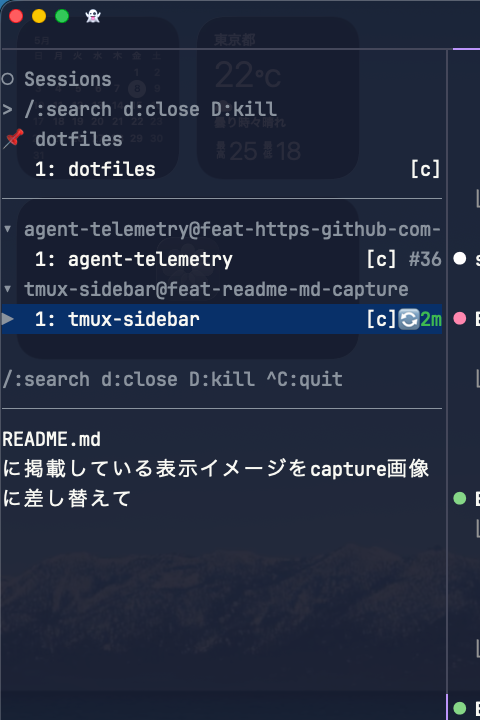
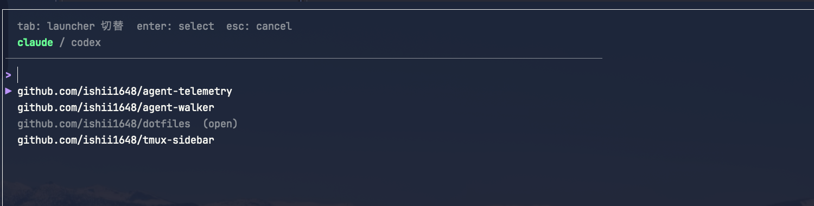

# tmux-sidebar

tmux の **cross-context 軸（session / window）** を司る常駐 control surface。
左端 sidebar pane に全 session/window と agent (Claude Code / Codex CLI) の状態を一覧表示し、
キーボードで switch / close / pin などのライフサイクル操作を発行する。



*常駐 sidebar pane: 全 session/window と agent state を一覧表示*



*popup picker (`tmux-sidebar new`): repo + launcher + prompt のワンフロー作成*

## Features

- 全 session / window を階層表示し、agent (Claude Code / Codex CLI) の state バッジを行末に描画
- vim 風 modal 入力（`j`/`k`/`Enter` で切替、`d`/`D` で close、`/` で incremental search）
- `tmux-sidebar new`（tmux.conf bind-key 経由で popup 起動）で repo + launcher + prompt を 1 ステップで作成
- pin / hidden で session の表示順と削除保護を制御

## Required tools

| ツール | 用途 |
|---|---|
| `tmux` 3.2+ | popup / pane / session 制御 |
| `git` | worktree / branch 操作 |
| `ghq` | repo 一覧 |
| [`claude`](https://github.com/anthropics/claude-code) | `--launcher claude` の launcher、popup 経由 dispatch の LLM branch 命名 |
| [`codex`](https://github.com/openai/codex) | `--launcher codex` の launcher |

`claude` / `codex` は片方でも動作する。詳細は [docs/spec.md](docs/spec.md#required-external-tools) を参照。

## Installation

```sh
gh release download --repo ishii1648/tmux-sidebar --pattern '*darwin_arm64*' --output - | tar xz
mv tmux-sidebar ~/.local/bin/
```

> OS/アーキテクチャに合わせてパターンを変更してください（例: `*linux_amd64*`）。

## Setup

最低限 [§1 サイドバー自動生成](docs/setup.md#1-サイドバー自動生成必須) と [§2 誤フォーカス防止 + カーソル追従通知](docs/setup.md#2-sidebar-への誤フォーカス防止--カーソル追従通知必須) を `tmux.conf` に追記すれば動作する。任意項目（toggle / focus キーバインド、agent hook、popup picker など）は [docs/setup.md](docs/setup.md) を参照。

## Documentation

- [docs/spec.md](docs/spec.md) — ユーザ視点の振る舞い (what)：入力モデル / 状態バッジ / popup picker / configuration / subcommands
- [docs/setup.md](docs/setup.md) — `tmux.conf` と agent hook の設定手順
- [docs/design.md](docs/design.md) — 実装上の設計 (how)
- [docs/history.md](docs/history.md) — 過去の判断と分岐 (why)

## License

MIT
